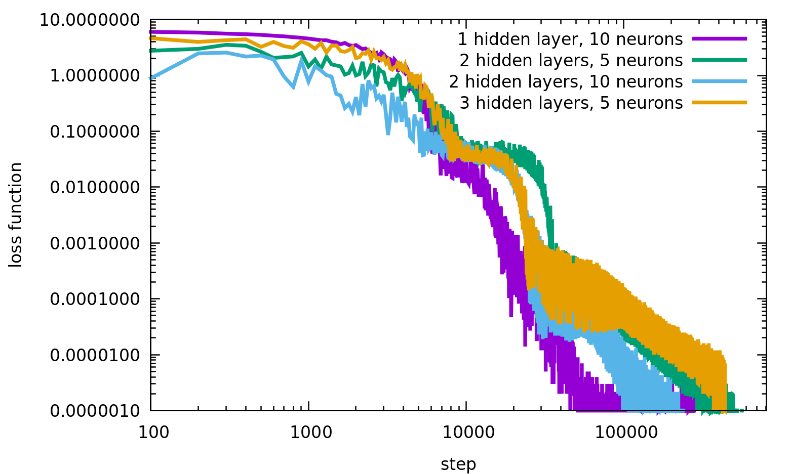

# Neural-network-to-fit-data
Neural network programmed with C++/CUDA to find a function fitting a set of data points.
Developed by Adolfo Vázquez-Quesada. 

mail: a.vazquez-quesada@fisfun.uned.es

  

--------------------------------------------------

- Host variables and functions are declared in class_system.h.
  Each function is defined in its own file, specifically in system_* files.

- Device variables and functions are declared in kernel_functions.h.
  Each function is defined in its own file, specifically in kernel_* files.

- In config.h we can define if the real variables are float or double.

- main.cu is the main file of the code.

# Compilation 
The compilation is done with the makefile file. 
To compile, just write the following command in the command line:

make

The file neural_network_program will be created, which is the executable.

If you want to clean everthing before compiling again, just do

make clean

# Running the program

You need to have the following files in the same directory (with the exact names shown below):

- **neural_network_program**: the executable.
- **input**: a file containing the program inputs.
- **data.dat**: the data to be fitted by the neural network.

To run the program, execute:

./neural_network_program

# Input Variables

**Nneurons**               -> Number of neurons per hidden layer

**Nhidden**                -> Number of hidden layers

**Niterations**            -> Number of training iterations

**N_per_batch**            -> Number of data points per batch
                     
**initialization**         -> Initialization method for weights and biases. There are two options:

                             1.- Uniform random distribution in the interval (-epsilon, epsilon)
                      
                             2.- Xavier initialization

**epsilon**               -> Parameter used when initialization = 1

**initial_learning_rate** -> Initial learning rate of the neural network

**beta1**                 -> ADAM optimizer parameter for the gradient descent update

**beta2**                 -> ADAM optimizer parameter for the gradient descent update

**epsilon_adam**          -> ADAM optimizer parameter used for numerical stability

**Nfiles**                -> This variable is not currently used and will be removed in future updates

**freq_loss_function**    -> Frequency (in iterations) at which the loss function value is written to the file `loss_function.dat`

**freq_gnu_file**         -> Frequency (in iterations) at which the file `approx_function-%d.gnu` is generated, where `%d` is the iteration number.  
                             This file is a gnuplot script used to plot the fitted function

# Data File

The file `data.dat` must contain three columns corresponding to the x, y, and z values of each data point.

# Output Files

**loss_function.dat** -> Two columns:

                      Column 1 -> Iteration

                      Column 2 -> Loss function value

**approx_function-%d.gnu**, where `%d` is the iteration number.

This is a script for the gnuplot program used to plot the function fitted by the neural network. To run it, simply execute:

  gnuplot approx_function-%d.gnu
